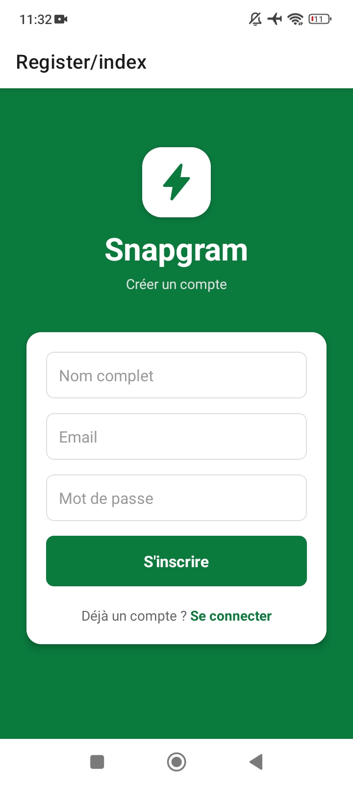
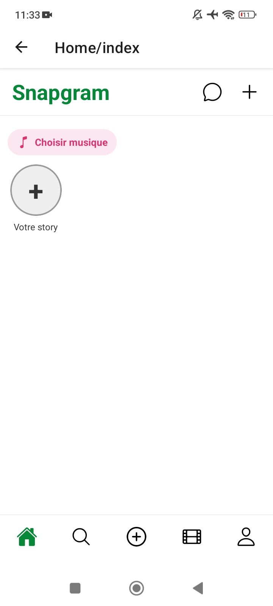
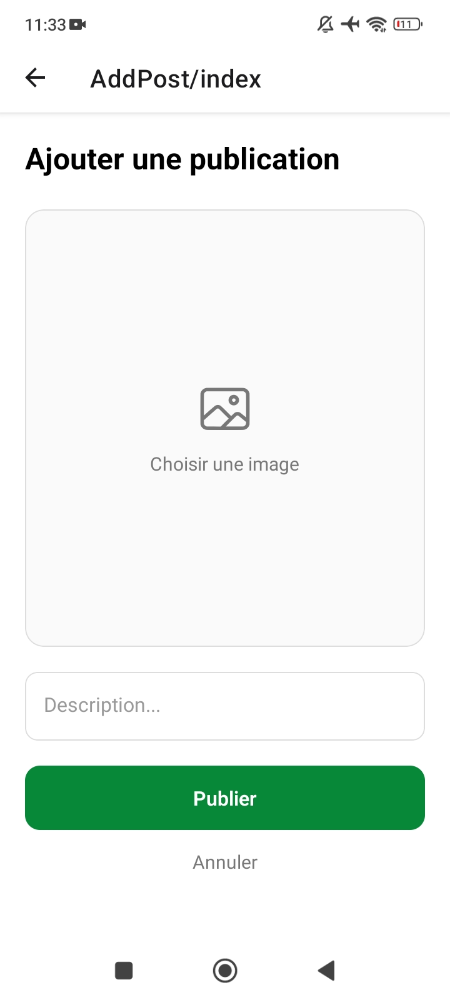
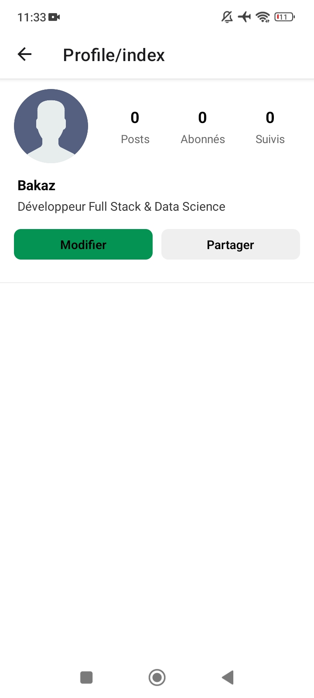
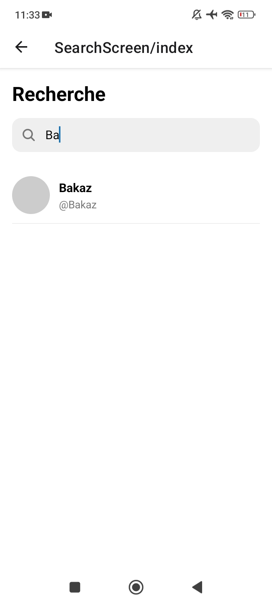
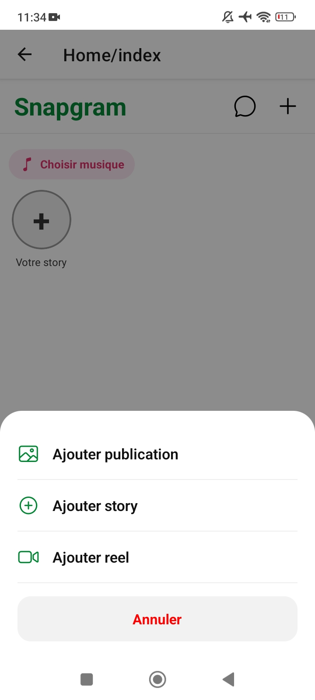
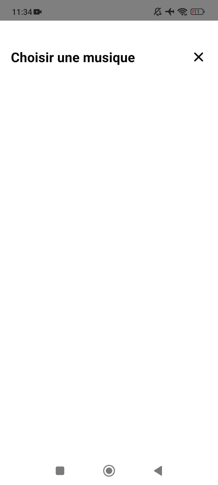

<h2>1. Présentation du projet</h2>

  <strong>Snapgram</strong> est une application mobile de type réseau social inspirée d’Instagram,
  développée avec React Native, Expo et Spring Boot.

<h2>2. Objectif de l'application</h2>

  L’objectif de cette application est de permettre aux utilisateurs de partager des posts,
  des reels, des stories, d’interagir avec d’autres utilisateurs et de communiquer par messages.

<h2>3. Fonctionnalités principales</h2>
<ul>
  <li>Authentification</li>
  <li>Posts</li>
  <li>Reels</li>
  <li>Stories</li>
  <li>Profil utilisateur</li>
  <li>Recherche</li>
  <li>Messages</li>
  <li>Likes / Commentaires</li>
</ul>

<h2>4. Technologies utilisées</h2>

<h3>Frontend Mobile</h3>

  
  
  

<ul>
  <li>React Native</li>
  <li>Expo</li>
  <li>TypeScript</li>
</ul>

<h3>Backend</h3>

  
  

<ul>
  <li>Java</li>
  <li>Spring Boot</li>
  <li>REST API</li>
</ul>

<h3>Base de données</h3>

  

<ul>
  <li>SQL Server</li>
</ul>

<h2>6. Structure des dossiers</h2>

<pre>
Snapgram/
├── frontend/
│   ├── app/
│   ├── components/
│   ├── constants/
│   └── assets/
│
├── backend/
│   ├── controller/
│   ├── model/
│   ├── repository/
│   ├── service/
│   ├── config/
│   └── uploads/
</pre>

<h2>7. Installation et lancement</h2>

<h3>Backend</h3>

<pre>
cd backend
mvn spring-boot:run
</pre>

<h3>Frontend</h3>

<pre>
cd frontend
npm install
npx expo start
</pre>

<h2>8. Configuration</h2>

<ul>
  <li><strong>Base URL :</strong> URL du backend Spring Boot</li>
  <li><strong>CORS :</strong> autoriser les requêtes du frontend mobile</li>
  <li><strong>Uploads :</strong> dossier pour stocker les images et vidéos</li>
</ul>

<h2>9. API principales</h2>

<ul>
  <li><strong>Auth API</strong> → Gestion de l'authentification</li>
  <li><strong>Users API</strong> → Gestion des utilisateurs et profils</li>
  <li><strong>Posts API</strong> → Gestion des publications</li>
  <li><strong>Stories API</strong> → Gestion des stories</li>
  <li><strong>Reels API</strong> → Gestion des reels</li>
  <li><strong>Messages API</strong> → Gestion de la messagerie</li>
</ul>

<h2>10. Captures d'écran</h2>

  
  
  

  
  
  

  
  

<h2>11. Démo vidéo</h2>

  Une vidéo de démonstration de l'application est disponible ci-dessous :

  🎥 <a href="#">Voir la démo vidéo</a>

<h2>12. Améliorations futures</h2>

<ul>
  <li>Notifications en temps réel</li>
  <li>Appels audio et vidéo</li>
  <li>Système de suivi (Follow / Unfollow)</li>
  <li>Sauvegarde des publications</li>
  <li>Suggestions d'utilisateurs</li>
  <li>Statut en ligne / hors ligne</li>
  <li>Stories avec réactions</li>
  <li>Mode sombre</li>
  <li>Partage de publications</li>
  <li>Messagerie temps réel avec WebSocket</li>
</ul>

<h2>13. Auteur</h2>

  

<h3 align="center">Hicham Bakaz</h3>

  Master's Student in Intelligent Web and Data Science 
  Full-Stack Developer • Data Scientist • AI Enthusiast

  
  
  

